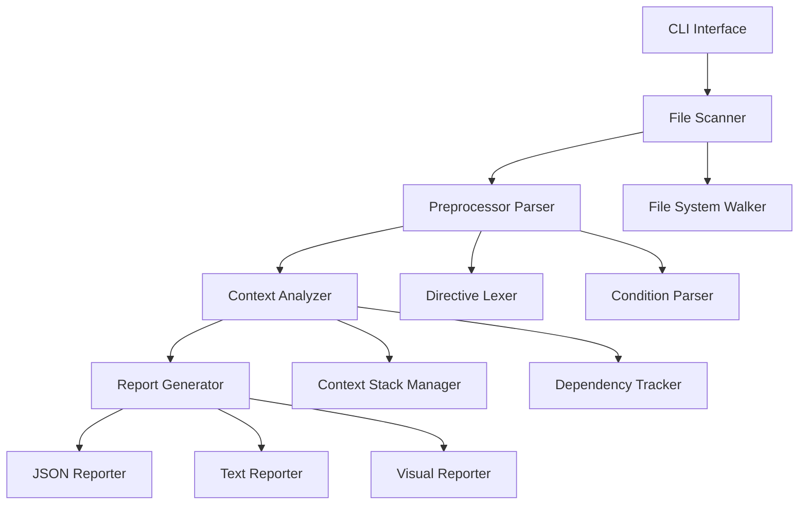
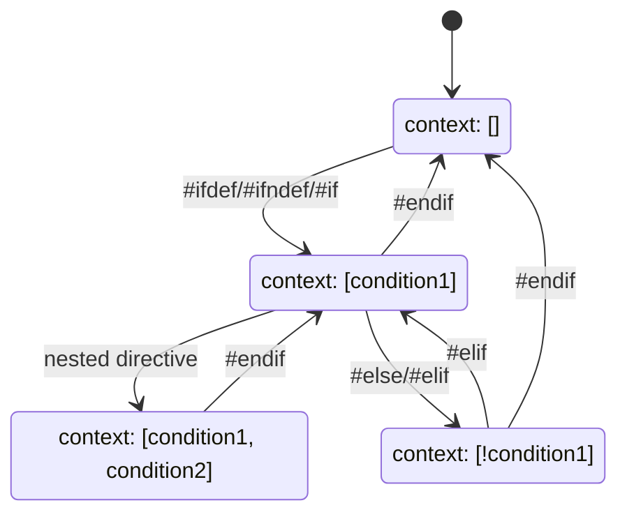

# C++ Preprocessor Directive Analysis Tool Design

## Overview

The C++ Preprocessor Directive Analysis Tool is a Python-based command-line utility designed to parse C++ source files and comprehensively analyze preprocessor directive usage patterns. The tool identifies all preprocessor directives (#define, #ifdef, #ifndef, #else, #elif, #endif) and determines the conditional compilation contexts under which each #define statement is declared.

### Core Objectives
- Parse C++ source files to extract all preprocessor directives
- Build a contextual hierarchy of conditional compilation blocks
- Track the conditions under which each #define is declared
- Generate detailed reports showing directive relationships and dependencies
- Support both single file and project-wide analysis

## Architecture

The system follows a modular architecture with clear separation of concerns:

### Core Components

| Component | Responsibility |
|-----------|---------------|
| CLI Interface | Command-line argument parsing, configuration management |
| File Scanner | Recursive file discovery, C++ file identification |
| Preprocessor Parser | Tokenization and parsing of preprocessor directives |
| Context Analyzer | Conditional compilation context tracking |
| Report Generator | Output formatting and report generation |

## Command Reference

### Primary Commands

| Command | Purpose | Example Usage |
|---------|---------|---------------|
| `analyze` | Analyze preprocessor directives in specified files/directories | `tool analyze src/` |
| `report` | Generate detailed reports from analysis results | `tool report --format json` |
| `validate` | Validate preprocessor directive syntax and nesting | `tool validate file.cpp` |

### Command Details

#### `analyze` Command
- **Purpose**: Main analysis command for processing C++ files
- **Arguments**: 
  - `path`: File or directory path to analyze
- **Options**:
  - `--recursive, -r`: Recursively scan directories
  - `--include-headers`: Include header files (.h, .hpp)
  - `--output, -o`: Output file for results
  - `--format`: Output format (json, xml, yaml)
  - `--exclude`: Patterns to exclude from analysis

#### `report` Command
- **Purpose**: Generate formatted reports from analysis data
- **Options**:
  - `--input, -i`: Input analysis data file
  - `--format`: Report format (text, html, markdown)
  - `--show-dependencies`: Include dependency analysis
  - `--filter-defines`: Filter by specific define patterns

#### `validate` Command
- **Purpose**: Syntax validation and error detection
- **Arguments**:
  - `files`: One or more C++ files to validate
- **Options**:
  - `--strict`: Enable strict validation rules
  - `--check-balance`: Verify directive nesting balance

## Preprocessor Directive Analysis Engine

### Directive Recognition System

The analysis engine recognizes and categorizes the following preprocessor directives:

| Directive Type | Directives | Analysis Focus |
|----------------|------------|----------------|
| Conditional | #ifdef, #ifndef, #if | Condition evaluation and nesting |
| Control Flow | #else, #elif, #endif | Block structure and matching |
| Definition | #define, #undef | Symbol definition tracking |
| Inclusion | #include | Dependency relationships |

### Context Tracking Architecture

### Define Context Analysis

For each #define directive, the system tracks:

| Attribute | Description | Example |
|-----------|-------------|---------|
| Definition Location | File and line number | src/config.h:45 |
| Context Stack | Active conditional contexts | [DEBUG, !RELEASE, PLATFORM_WIN32] |
| Condition Expression | Complete boolean expression | DEBUG && !RELEASE && PLATFORM_WIN32 |
| Scope Level | Nesting depth | 3 |
| Dependencies | Required symbol definitions | DEBUG, RELEASE, PLATFORM_WIN32 |

## Data Models

### Directive Representation

| Field | Type | Description |
|-------|------|-------------|
| type | String | Directive type (define, ifdef, ifndef, etc.) |
| content | String | Full directive content |
| line_number | Integer | Source line number |
| file_path | String | Source file path |
| condition | String | Conditional expression (if applicable) |
| context | Array | Active context stack |

### Context Stack Model

| Field | Type | Description |
|-------|------|-------------|
| conditions | Array | Stack of active conditions |
| negations | Array | Negation flags for each condition |
| depth | Integer | Current nesting depth |
| file_context | String | Current file being processed |

### Analysis Result Schema

| Field | Type | Description |
|-------|------|-------------|
| defines | Array | All #define directives found |
| conditions | Object | Mapping of conditions to usage count |
| file_summary | Object | Per-file directive statistics |
| dependency_graph | Object | Symbol dependency relationships |
| validation_errors | Array | Syntax and nesting errors |

## Report Generation System

### Output Formats

| Format | Use Case | Content Structure |
|--------|----------|------------------|
| JSON | Programmatic processing | Structured data with full context |
| Text | Human-readable summary | Tabular format with key statistics |
| HTML | Interactive visualization | Web-based with expandable sections |
| Markdown | Documentation integration | Formatted text with code blocks |

### Report Sections

#### Define Summary Report
- Lists all #define directives with their contexts
- Groups defines by conditional requirements
- Shows usage frequency and file distribution

#### Conditional Analysis Report
- Displays conditional directive nesting structure
- Identifies unreachable code blocks
- Reports missing #endif directives

#### Dependency Graph Report
- Visualizes symbol dependencies
- Identifies circular dependencies
- Shows conditional dependency chains

## Testing Strategy

### Unit Testing Framework
- Parser component validation with sample C++ code fragments
- Context tracking accuracy verification
- Report generation format compliance testing

### Integration Testing Scenarios
- Large codebase analysis performance testing
- Complex nesting structure handling validation
- Multi-file project analysis accuracy verification

### Test Data Categories
- Simple conditional blocks
- Deeply nested preprocessor structures
- Edge cases with malformed directives
- Real-world C++ project samples

## Error Handling Strategy

### Validation Rules

| Error Type | Detection Method | Recovery Strategy |
|------------|------------------|-------------------|
| Unmatched #endif | Stack depth tracking | Report location and continue |
| Missing #endif | End-of-file validation | Insert virtual #endif |
| Invalid syntax | Regex pattern matching | Skip directive with warning |
| Circular includes | Dependency graph analysis | Break cycle and report |

### Error Reporting Format
- Structured error objects with file location
- Severity levels (warning, error, critical)
- Suggested fixes where applicable
- Context information for debugging